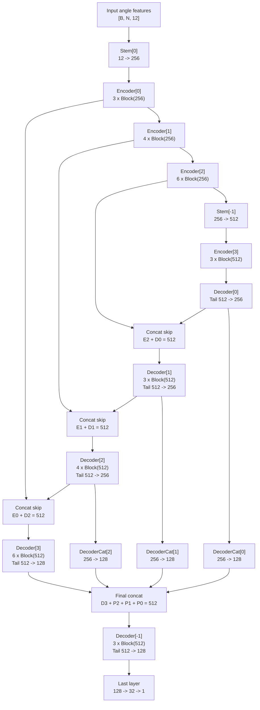

# UNet Predict Angle Architecture

## Scope

This document summarizes the model structure of `UNet_predict_angle` in `NeurCross/models/UNet.py`, with a focus on:

- module composition
- encoder / decoder data flow
- tensor shape changes
- the differences from a classical convolutional U-Net
- the way this model is used in training

The goal is to make the code easier to read before changing the architecture.


## Where It Is Used

`UNet_predict_angle` is instantiated in `NeurCross/models/DiGS.py` as the angle prediction branch:

- input feature dimension: `angle_in_dim=12`
- output feature dimension: `C_out=1`

In training, the angle branch consumes the concatenation of:

- manifold points: `mnfld_points` with 3 channels
- ground-truth normals: `mnfld_n_gt` with 3 channels
- local frame axis `u`: `local_coord_u` with 3 channels
- local frame axis `v`: `local_coord_v` with 3 channels

So the runtime input is:

- `3 + 3 + 3 + 3 = 12`

The predicted output is then multiplied by `2 * pi` in `NeurCross/models/DiGS.py` to convert it into radians.


## High-Level View

Despite its name, this implementation is not a classical image U-Net with convolution, downsampling, and upsampling.

Instead, it is better described as:

- a token-wise MLP encoder-decoder
- with residual MLP blocks
- with skip connections in feature space
- with a final multi-scale decoder feature fusion head

The token count `N` is kept unchanged throughout the entire forward pass. Only the feature dimension changes.

This means the model operates on tensors shaped like:

- `[B, N, C]`

where:

- `B` is batch size
- `N` is the number of points or faces
- `C` is the feature dimension


## Main Building Blocks

### 1. `LayerNorm`

`LayerNorm` is a custom implementation that supports:

- `channels_last`
- `channels_first`

In this model, the actual usage is `channels_last`, so normalization is applied along the last dimension of `[B, N, C]`.


### 2. `Stem`

`Stem` is a lightweight projection block:

```python
Linear(in_dim, out_dim) -> LayerNorm(out_dim)
```

Its job is to map input features into the hidden feature space used by the encoder.


### 3. `Block`

`Block` is the core residual MLP block. Its structure is:

```python
Linear(dim, dim // 4)
LayerNorm(dim // 4)
ReLU
Linear(dim // 4, dim // 4)
LayerNorm(dim // 4)
ReLU
Linear(dim // 4, dim)
Residual Add
ReLU
```

This is effectively a bottleneck MLP residual block.

It also includes:

- `gamma`: layer scale parameter
- `DropPath`: stochastic depth

So each block is not only a plain MLP, but a stabilized residual block with regularization.


### 4. `Tail`

`Tail` is used as a dimension-conversion head:

```python
LayerNorm(in_dim) -> Linear(in_dim, out_dim)
```

It appears repeatedly in the decoder and in the final projection path.


## Default Architecture Configuration

The default constructor is:

```python
UNet_predict_angle(
    C_in,
    C_out,
    depths=[3, 4, 6, 3],
    stem_dims=[256, 256, 512],
    dims=[256, 256, 256, 512],
    decode_out_dims=[256, 256, 256, 128],
    drop_path_rate=0.,
    layer_scale_init_value=1e-6
)
```

Under this configuration:

- encoder stage widths are `256, 256, 256, 512`
- decoder stage outputs are `256, 256, 256, 128`
- stage depths are `3, 4, 6, 3`


## Encoder Structure

The encoder is composed of:

1. one input `Stem`
2. three encoder stages at width `256`
3. one final `Stem` that lifts features from `256` to `512`
4. one final encoder stage at width `512`

The effective runtime path is:

```text
input
-> stem[0]
-> encoder[0]
-> encoder[1]
-> encoder[2]
-> stem[-1]
-> encoder[-1]
```

Important note:

- several `Stem` modules are created in `__init__`
- but in the actual `forward()` path, only `stems[0]` and `stems[-1]` are used

This is worth remembering when refactoring the model, because the declared module list is slightly more general than the real execution path.


## Decoder Structure

The decoder has two levels of fusion.

### First-Level Decoder

The first-level decoder follows the U-Net idea:

- start from the bottleneck feature
- project it into decoder width
- concatenate with encoder skip features
- process the concatenated features

In this implementation:

- `decoders[0]` maps bottleneck `512 -> 256`
- `decoders[1]`, `decoders[2]`, `decoders[3]` each consume a concatenated `512`-dim feature
- the last of these outputs `128` channels

### Second-Level Decoder Fusion

After the normal decoder path, the model performs another fusion step:

- `decode_feat[0]`, `decode_feat[1]`, `decode_feat[2]` are projected by `decoders_cat`
- each is reduced to `128` channels
- these three features are concatenated with `decode_feat[-1]`
- the merged `512`-dim tensor goes through a final decoder block

This acts like a multi-scale decoder fusion head.


## Mermaid Architecture Diagram




## Forward Pass Walkthrough

### Step 1: input validation

The model first checks:

- the last dimension of `x_in` must equal `self.C_in`
- supported shapes are `[N, C]` or `[B, N, C]`

If the input is `[N, C]`, a batch dimension is appended internally.


### Step 2: encoder feature extraction

With the training configuration, the feature flow is:

```text
[B, N, 12]
-> Stem[0]
-> [B, N, 256]
-> Encoder[0]
-> [B, N, 256]
-> Encoder[1]
-> [B, N, 256]
-> Encoder[2]
-> [B, N, 256]
-> Stem[-1]
-> [B, N, 512]
-> Encoder[3]
-> [B, N, 512]
```

The intermediate outputs after `Encoder[0]`, `Encoder[1]`, and `Encoder[2]` are stored in `encoder_feat` for skip connections.


### Step 3: decoder with skip concatenation

The bottleneck feature first goes through:

```text
[B, N, 512] -> Decoder[0] -> [B, N, 256]
```

Then the model repeatedly performs:

1. concatenate current decoder feature with the corresponding encoder skip feature
2. process the result with the next decoder stage

This produces:

```text
concat(E2, D0): [B, N, 512] -> D1 -> [B, N, 256]
concat(E1, D1): [B, N, 512] -> D2 -> [B, N, 256]
concat(E0, D2): [B, N, 512] -> D3 -> [B, N, 128]
```


### Step 4: multi-scale decoder fusion

Earlier decoder outputs are not discarded.

Instead:

- `D0` is projected to `128`
- `D1` is projected to `128`
- `D2` is projected to `128`
- `D3` is already `128`

Then these four `128`-dim features are concatenated:

```text
[B, N, 128] x 4 -> [B, N, 512]
```

This merged tensor is processed by the final decoder head:

```text
[B, N, 512] -> Decoder[-1] -> [B, N, 128]
```


### Step 5: output projection

The last layer maps:

```text
[B, N, 128] -> [B, N, 32] -> [B, N, 1]
```

Outside this module, the output is multiplied by `2 * pi` to obtain the final angle in radians.


## Shape Summary

With the training configuration, the full shape path is:

```text
Input                : [B, N, 12]
Stem[0]              : [B, N, 256]
Encoder[0]           : [B, N, 256]
Encoder[1]           : [B, N, 256]
Encoder[2]           : [B, N, 256]
Stem[-1]             : [B, N, 512]
Encoder[3]           : [B, N, 512]
Decoder[0]           : [B, N, 256]
Decoder[1]           : [B, N, 256]
Decoder[2]           : [B, N, 256]
Decoder[3]           : [B, N, 128]
Final fused decoder  : [B, N, 128]
Output               : [B, N, 1]
```


## Differences From a Classical U-Net

This implementation differs from a standard image U-Net in several important ways:

1. No convolution is used.
2. No spatial downsampling or upsampling is used.
3. The token count `N` stays constant.
4. Skip connections happen by concatenating feature vectors along the last dimension.
5. The model includes an extra decoder fusion stage after the main skip-decoder path.

So the shape of the "U" comes from feature hierarchy and skip fusion, not from image resolution changes.


## Code Reading Notes

When reading or modifying this file, the following details are important:

1. `cluster()` is defined but not used by `UNet_predict_angle`.
2. `stems[1]` and `stems[2]` are created but are not used in the current `forward()` path.
3. `mass` and `faces` appear in the method signature, but they do not affect the actual forward computation here.
4. In `DiGS.py`, the second argument passed into `decoder_angle` lands in the `mass` parameter position, but for the current batched usage path this does not affect computation.

These details suggest that the implementation has some historical remnants and may have evolved from an earlier, more general design.


## Practical Interpretation

From a modeling perspective, this branch predicts one scalar angle for each point or face based on:

- position
- normal
- local tangent frame information

Because the model preserves token count and only transforms feature channels, it is suitable for per-element regression where each element should keep its identity throughout the network.

The skip connections help preserve lower-level geometric information, while the deeper stages and final fusion head provide higher-level contextual features for the final angle prediction.
