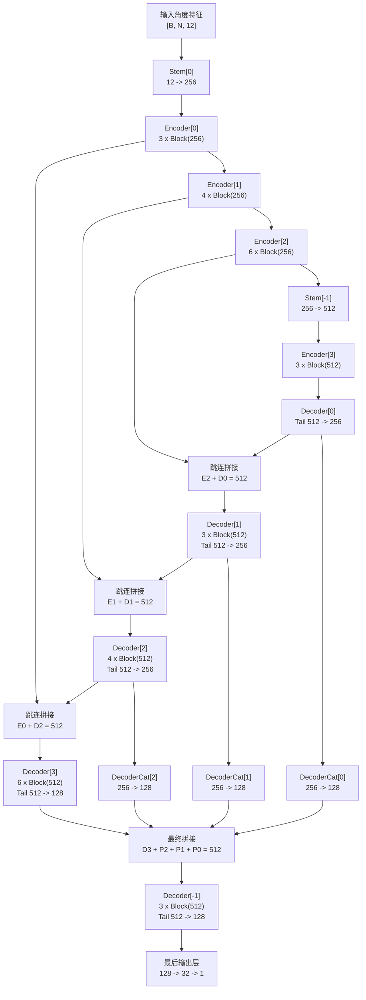

# UNet_predict_angle 模型结构说明

## 文档范围

本文整理 `NeurCross/models/UNet.py` 中 `UNet_predict_angle` 的模型结构，重点说明以下内容：

- 模块组成
- 编码器 / 解码器的数据流
- 张量形状变化
- 它与经典卷积 U-Net 的差异
- 它在训练流程中的实际接入方式

这份文档的目标，是让后续读代码、改结构、查维度时更直接。


## 使用位置

`UNet_predict_angle` 在 `NeurCross/models/DiGS.py` 中被实例化为角度预测分支：

- 输入维度：`angle_in_dim=12`
- 输出维度：`C_out=1`

训练时，这个分支接收的输入特征由 4 组 3 维向量拼接而成：

- 流形点坐标 `mnfld_points`
- 真实法向 `mnfld_n_gt`
- 局部坐标系 `u` 方向 `local_coord_u`
- 局部坐标系 `v` 方向 `local_coord_v`

因此运行时输入维度为：

- `3 + 3 + 3 + 3 = 12`

模型输出 1 维角度值，随后在 `NeurCross/models/DiGS.py` 中乘以 `2 * pi`，转换为弧度。


## 整体理解

虽然这个类名叫 `UNet_predict_angle`，但它并不是经典图像任务里的“卷积 + 下采样 + 上采样”式 U-Net。

更准确地说，这个实现是一个：

- 基于 token 的 MLP 编码器-解码器
- 采用残差 MLP 块
- 在特征维上做跳连拼接
- 最后带一个多尺度解码特征融合头

整个前向过程中，token 数量 `N` 不变，变化的是最后一维特征通道数。因此它处理的核心张量形状是：

- `[B, N, C]`

其中：

- `B` 表示 batch size
- `N` 表示点或面的数量
- `C` 表示特征维度


## 基础模块

### 1. `LayerNorm`

`LayerNorm` 是一个自定义层归一化实现，支持两种数据格式：

- `channels_last`
- `channels_first`

这个模型实际使用的是 `channels_last`，也就是对 `[B, N, C]` 的最后一维 `C` 做归一化。


### 2. `Stem`

`Stem` 是一个很轻量的特征投影模块：

```python
Linear(in_dim, out_dim) -> LayerNorm(out_dim)
```

它的作用是把输入特征映射到编码器使用的隐藏维度空间。


### 3. `Block`

`Block` 是整个模型里最核心的残差 MLP 模块，结构如下：

```python
Linear(dim, dim // 4)
LayerNorm(dim // 4)
ReLU
Linear(dim // 4, dim // 4)
LayerNorm(dim // 4)
ReLU
Linear(dim // 4, dim)
Residual Add
ReLU
```

它本质上是一个 bottleneck 形式的残差 MLP 块。

这个块还额外带有两种稳定训练的小技巧：

- `gamma`：layer scale 参数
- `DropPath`：随机深度

所以它不是简单的三层 MLP，而是带残差、带缩放、带正则的稳定结构。


### 4. `Tail`

`Tail` 主要用于特征维度变换，结构是：

```python
LayerNorm(in_dim) -> Linear(in_dim, out_dim)
```

它在解码阶段和最后输出阶段被多次使用。


## 默认配置

`UNet_predict_angle` 的默认构造参数如下：

```python
UNet_predict_angle(
    C_in,
    C_out,
    depths=[3, 4, 6, 3],
    stem_dims=[256, 256, 512],
    dims=[256, 256, 256, 512],
    decode_out_dims=[256, 256, 256, 128],
    drop_path_rate=0.,
    layer_scale_init_value=1e-6
)
```

按默认配置理解：

- 编码器各 stage 的宽度分别是 `256, 256, 256, 512`
- 解码器各 stage 的输出宽度分别是 `256, 256, 256, 128`
- 各 stage 的深度分别是 `3, 4, 6, 3`


## 编码器结构

编码器的实际运行路径可以理解为：

1. 先经过一个输入投影 `Stem`
2. 再经过三个 `256` 维的编码 stage
3. 然后通过最后一个 `Stem` 把特征从 `256` 提升到 `512`
4. 最后再经过一个 `512` 维的编码 stage

实际前向路径是：

```text
input
-> stem[0]
-> encoder[0]
-> encoder[1]
-> encoder[2]
-> stem[-1]
-> encoder[-1]
```

这里有一个非常重要的阅读细节：

- `__init__()` 中创建了多个 `Stem`
- 但在真实 `forward()` 里，当前只使用了 `stems[0]` 和 `stems[-1]`

也就是说，模块列表的定义比真实执行路径更“宽”，这是之后重构时需要注意的地方。


## 解码器结构

解码器并不只是普通的一次性上采样路径，它包含两层融合逻辑。

### 第一层：主解码路径

这部分最接近 U-Net 的典型思路：

- 从 bottleneck 特征开始
- 先投影到解码器宽度
- 再和对应编码器特征做跳连拼接
- 对拼接后的结果继续做解码

在这个实现里：

- `decoders[0]` 先把 bottleneck 从 `512 -> 256`
- `decoders[1]`、`decoders[2]`、`decoders[3]` 都吃一个拼接后的 `512` 维特征
- 最后一个主解码 stage 输出 `128` 维

### 第二层：多尺度解码特征融合

主解码路径跑完后，模型没有直接输出，而是额外做了一次多尺度融合：

- `decode_feat[0]`、`decode_feat[1]`、`decode_feat[2]` 经过 `decoders_cat`
- 每一路都被压到 `128` 维
- 再和最后一级的 `decode_feat[-1]` 一起拼接
- 拼接后的 `512` 维特征继续经过最终 decoder head

这一步可以看成一个“多尺度解码特征聚合头”。


## Mermaid 结构图




## 前向传播走读

### 第一步：输入检查

模型先检查两件事：

- `x_in` 的最后一维必须等于 `self.C_in`
- 输入形状必须是 `[N, C]` 或 `[B, N, C]`

如果输入是 `[N, C]`，内部会临时补一个 batch 维，变成 `[1, N, C]`。


### 第二步：编码阶段

在训练配置下，编码器的维度流如下：

```text
[B, N, 12]
-> Stem[0]
-> [B, N, 256]
-> Encoder[0]
-> [B, N, 256]
-> Encoder[1]
-> [B, N, 256]
-> Encoder[2]
-> [B, N, 256]
-> Stem[-1]
-> [B, N, 512]
-> Encoder[3]
-> [B, N, 512]
```

其中，`Encoder[0]`、`Encoder[1]`、`Encoder[2]` 的输出会被保存到 `encoder_feat`，供后续跳连使用。


### 第三步：跳连解码

bottleneck 特征先经过：

```text
[B, N, 512] -> Decoder[0] -> [B, N, 256]
```

接着模型反复做下面两件事：

1. 将当前 decoder 特征和对应 encoder 特征沿最后一维拼接
2. 把拼接后的特征送入下一层 decoder

因此会得到：

```text
concat(E2, D0): [B, N, 512] -> D1 -> [B, N, 256]
concat(E1, D1): [B, N, 512] -> D2 -> [B, N, 256]
concat(E0, D2): [B, N, 512] -> D3 -> [B, N, 128]
```


### 第四步：多尺度解码特征融合

前面较浅层的 decoder 输出没有被丢掉，而是参与最终聚合：

- `D0` 压到 `128`
- `D1` 压到 `128`
- `D2` 压到 `128`
- `D3` 本身就是 `128`

然后把这四路特征拼起来：

```text
[B, N, 128] x 4 -> [B, N, 512]
```

再送入最终 decoder head：

```text
[B, N, 512] -> Decoder[-1] -> [B, N, 128]
```


### 第五步：输出投影

最后输出层执行：

```text
[B, N, 128] -> [B, N, 32] -> [B, N, 1]
```

模块外部再乘 `2 * pi`，得到最终的弧度角预测。


## 维度总览

按训练时的默认接法，完整形状变化如下：

```text
输入                : [B, N, 12]
Stem[0]             : [B, N, 256]
Encoder[0]          : [B, N, 256]
Encoder[1]          : [B, N, 256]
Encoder[2]          : [B, N, 256]
Stem[-1]            : [B, N, 512]
Encoder[3]          : [B, N, 512]
Decoder[0]          : [B, N, 256]
Decoder[1]          : [B, N, 256]
Decoder[2]          : [B, N, 256]
Decoder[3]          : [B, N, 128]
最终融合 decoder    : [B, N, 128]
输出                : [B, N, 1]
```


## 与经典 U-Net 的差异

这份实现和经典图像 U-Net 有几个关键差异：

1. 没有卷积层。
2. 没有空间下采样和上采样。
3. token 数量 `N` 从头到尾保持不变。
4. 跳连发生在最后一维特征通道上，通过 `concat(..., dim=-1)` 实现。
5. 主解码路径之后，又额外做了一次多尺度解码特征融合。

所以它的“U 形结构”主要体现在特征层级与跳连关系上，而不是图像分辨率变化上。


## 读代码时要特别注意的点

阅读或修改这份实现时，建议特别注意下面几个细节：

1. `cluster()` 函数在这个模型里没有被实际使用。
2. `stems[1]` 和 `stems[2]` 被创建了，但当前 `forward()` 路径没有用到。
3. `mass` 和 `faces` 虽然出现在函数签名里，但当前实现里并不参与核心计算。
4. `DiGS.py` 中传给 `decoder_angle()` 的第二个位置参数，会落在 `mass` 这个形参上，但对当前 batched 使用路径没有实际影响。

这些点说明这份实现里保留了一些历史演化痕迹，理解时最好把“声明出来的模块”和“真正走到的执行路径”区分开。


## 实际建模含义

从建模角度看，这个分支的目标是：根据每个点或面的局部几何描述，预测一个标量角度。

它使用的输入信息包括：

- 空间位置
- 法向信息
- 局部切平面坐标系

因为整个网络始终保持 token 身份不变，所以它很适合做逐点或逐面的回归任务。浅层特征保留了更直接的局部几何信息，深层特征提供了更强的上下文表达，最后通过跳连和多尺度融合共同支持角度预测。
